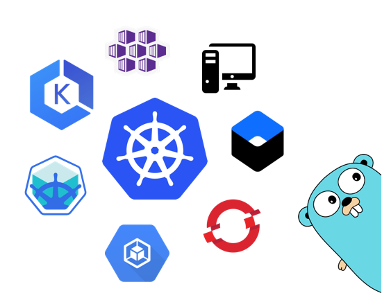

## k8s-discovery



*K8s Discovery*, is an effort to reduce the boiler plate code for the [client-go](https://github.com/kubernetes/client-go) or kubernetes based cloud native [GoLang](https://golang.org) developers.

The main aspect of this is around saving and cleaning the code for in-cluster and out-cluster configurations. 


## Usage

Run `go get` to get the *k8s-discovery* module as follows.

```
go get github.com/gkarthiks/k8s-discovery
```

Declare a variable as `var k8s *discovery.K8s` and initialize it as `k8s, _ = discovery.NewK8s()`. Now the **k8s** will hold the interface that will provide the clientset for Kubernetes communication that is pulled either via `in-cluster` or via `kubeconfig` file.

## Available APIs at the moment

<b>NewK8s:</b> Will return a new kubernetes clientset's interface that is formulated either via in-cluster configuration or kubeconfog file.

<b>GetVersion:</b> Queries the Kubernetes for the version in `v0.0.0-master+$Format:%h$`

<b>GetNamespace:</b> Gets the namespace of the running pod if running inside the cluster, if outside returns based on the `POD_NAMESPACE` environment variable. This environment variable also takes precedence if provided in a pod.


## Example
```go
package main

import (
	"fmt"
	"log"

	discovery "github.com/gkarthiks/k8s-discovery"
	metav1 "k8s.io/apimachinery/pkg/apis/meta/v1"
)

var (
	k8s *discovery.K8s
)

func main() {
	k8s, _ = discovery.NewK8s()
	namespace, _ := k8s.GetNamespace()
	version, _ := k8s.GetVersion()
	fmt.Printf("Specified Namespace: %s\n", namespace)
	fmt.Printf("Version of running Kubernetes: %s\n", version)
	cronJobs, err := k8s.Clientset.BatchV1beta1().CronJobs(namespace).List(metav1.ListOptions{})
	if err != nil {
		log.Panic(err.Error())
	}
	for idx, crons := range cronJobs.Items {
		fmt.Printf("%d -> %s\n", idx, crons.Name)
	}
}
```